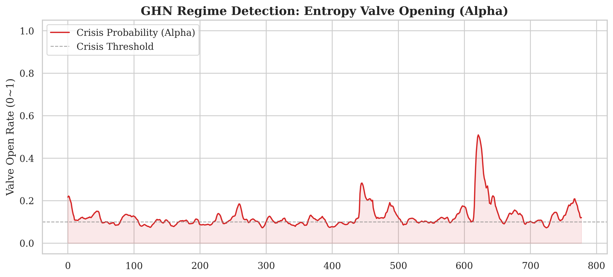
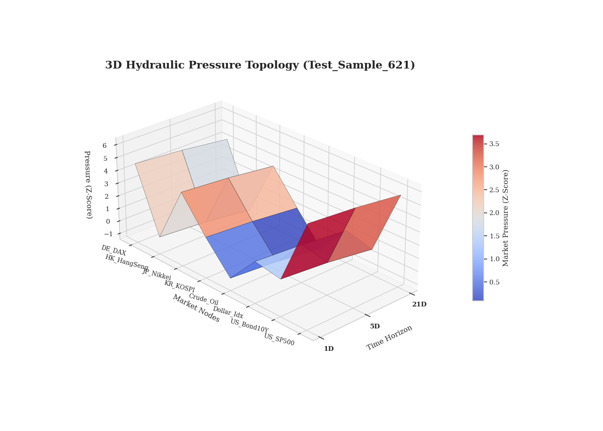
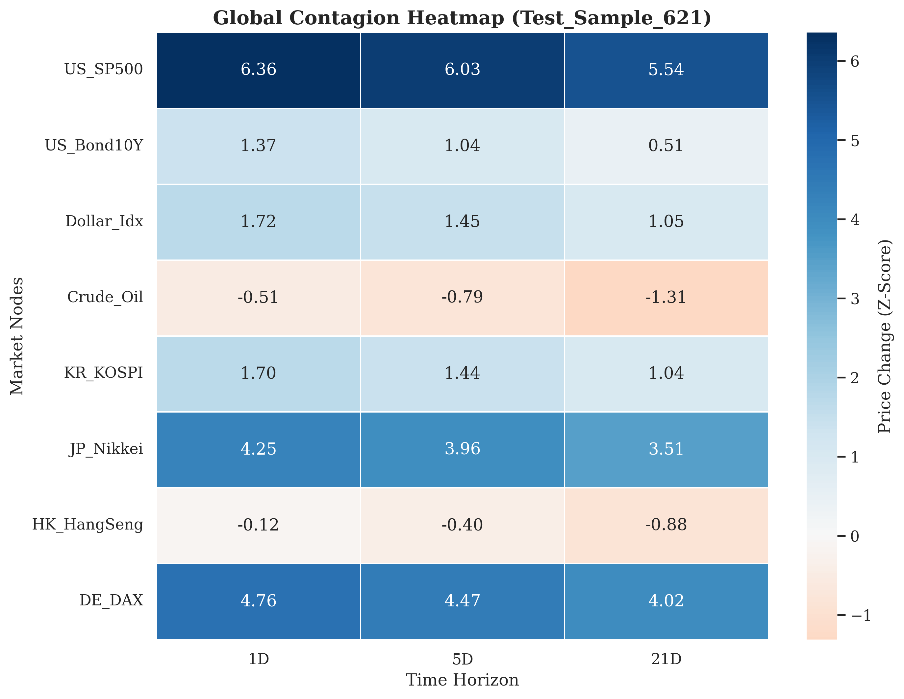
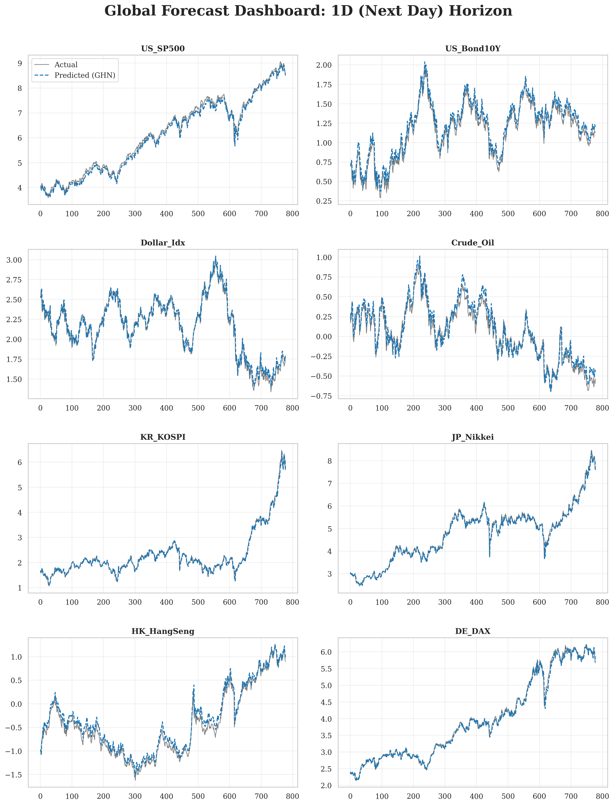

# 🌊 Global Hydraulic Network (GHN)
### Physics-Informed Contagion Modeling with Entropy-Gated Graph Neural Networks


> **"Financial markets behave like fluid dynamics: shocks are waves, correlations are pipes, and volatility is pressure."**

---

## 📖 Overview

**Global Hydraulic Network (GHN)** is a novel deep learning framework designed to model **systemic risk and financial contagion** across global markets. 

Unlike traditional statistical models, GHN integrates **Physical Laws (Reaction-Diffusion)** directly into the neural architecture. It treats the global financial network as a hydraulic system where market shocks flow like fluid through dynamic pipes, regulated by an **"Entropy Valve ($\alpha$)"** that opens only during crisis or extreme volatility regimes.

### 🎯 Key Research Contributions
1.  **Physics-Informed Learning (PINN):** Enforces energy conservation and dampening in shock propagation using a custom `HydraulicLoss`.
2.  **Dynamic Regime Detection:** An autonomous "Entropy Gate" detects high-volatility regimes and opens connection channels only when necessary.
3.  **Geopolitical Sensitivity:** Successfully captures the **structural decoupling** of specific markets (e.g., Hong Kong) during global liquidity surges.

---

## 🎨 Case Study: The May 2025 "Melt-up" (Sample 621)

The model identified a critical regime shift on **May 14, 2025**, characterized by an extreme upward liquidity shock triggered by cooling US inflation and an AI-driven market rally.

### 1. The Entropy Valve ($\alpha$) Activation

> **Observation:** During the stable period, the valve remains closed ($\alpha \approx 0.08$). At **Sample 621 (2025-05-14)**, the valve abruptly opens to **$\alpha = 0.51$**, acknowledging the surge in systemic entropy.

### 2. 3D Hydraulic Pressure Topology

> **Analysis:** The 3D surface visualizes a massive "Pressure Peak" in the US market (Z-Score: 6.36). This pressure flows rapidly into the Western bloc (Japan, Germany), while the Hong Kong market remains a "Topological Valley," indicating total decoupling.

### 3. Global Contagion Heatmap

> **Discovery:** While the S&P 500, Nikkei, and DAX show intense synchronization (Dark Blue), the **Hang Seng Index (HK)** remains neutral/negative (-0.12). This empirical result proves the model's ability to learn **Geopolitical Fragmentation** without explicit labels.

---

## 📊 Global Forecast Dashboard
*Performance on Test Set (1-Day Horizon).*



The model maintains high fidelity in trend-following across 8 diverse asset classes, effectively balancing local reaction and global diffusion.

---

## ⚙️ Methodology

The core mechanism follows a discretized **Reaction-Diffusion Equation**:

$$
\frac{\partial h_i(t)}{\partial t} = \alpha(t) \sum_{j \in \mathcal{N}(i)} D_{ij} (h_j - h_i) + R(h_i)
$$

* **$\alpha(t)$**: Learnable **Entropy Valve** that regulates the diffusion rate based on market volatility.

---

## 🚀 Getting Started

### Installation
```bash
pip install torch numpy pandas matplotlib seaborn yfinance scikit-learn